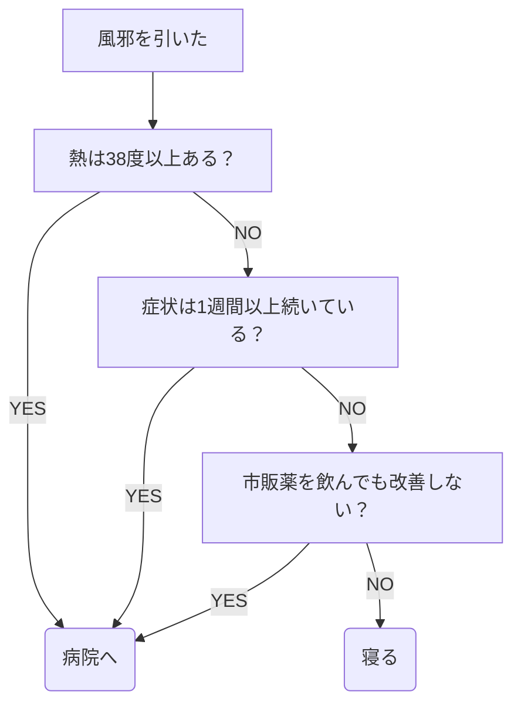
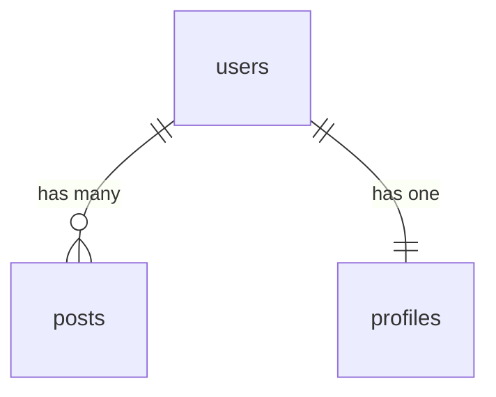
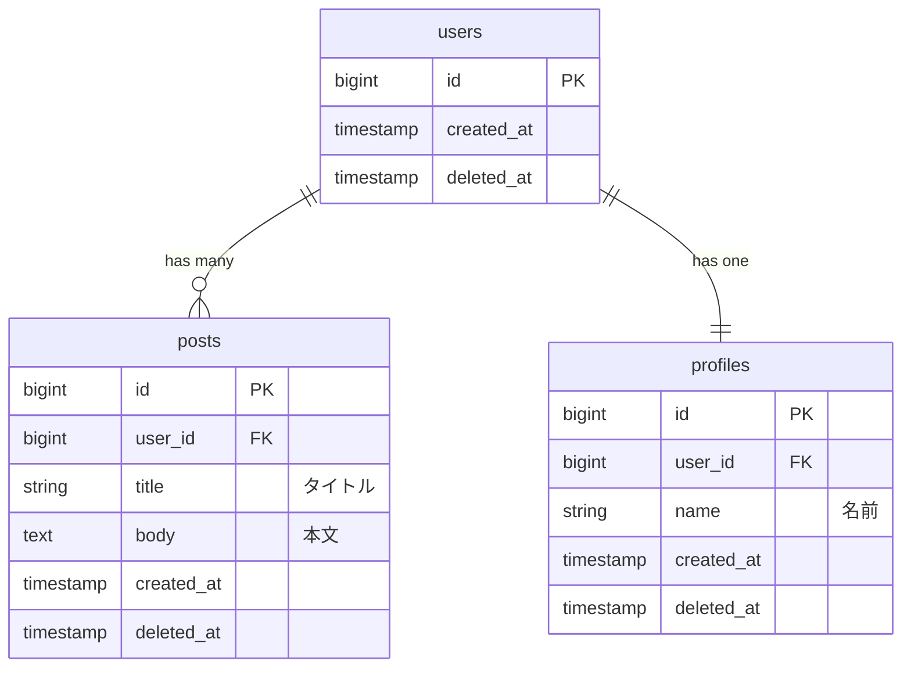
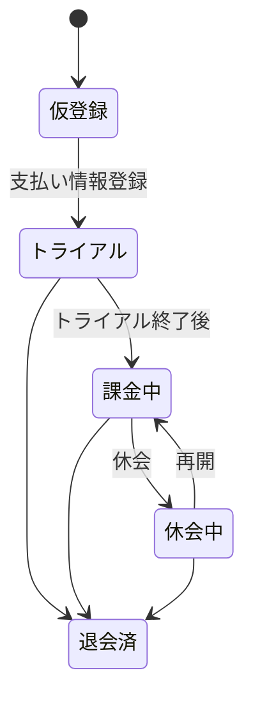
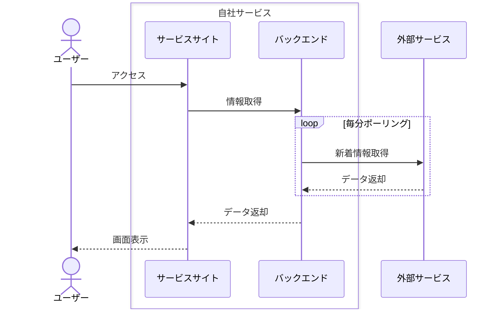

# はじめに
この記事ではシステム開発においてよく登場するフローチャートやER図、状態遷移図といった代表的な設計図の例と、これらを書く必要性について紹介します。

:::message
設計図を書くためのツールは沢山ありますが、今回はテキストベースのダイアグラム作成ツール **Mermaid** での記述例を紹介しています。
:::

# 開発において設計図を書く必要性
設計図といっても設計を行うために毎回必ずフローチャートやER図を作成するという環境は少ないと思います。

簡単な設計をいちいち図解していたら、開発や設計変更の速度に対して、作図をする手間がかかり過ぎてしまい開発スピードが落ちてしまいます。

## 設計図を書いた方が良いケース
個人的には以下の様なケースではなるべく設計図を書くように意識しています。

### コミュニケーションコストやレビューコストが高い機能開発
大規模な機能開発を複数人で行う場合や、複雑な処理を伴う機能開発を行う場合には開発者間でのコミュニケーションコスト（意思疎通や情報伝達にかかる時間）やレビューコスト（設計レビューやコードレビューに費やす時間）も大きくなります。

設計を図解することでコミュニケーションコストやレビューコストが下がり、結果的に品質や開発スピードの向上、手戻りのリスク低減にもつながります。

### 非エンジニアへの説明
非エンジニアに対して設計や処理の流れを説明する際にも、口頭やテキストベースの説明のみでは理解してもらえないケースがあります。

図解やモックアップの準備は勿論、専門用語を使わず一般的な用語に変換するなどの工夫をすることで非エンジニアでも理解しやすくなります。

### 思考の整理
設計に行き詰まった場合、思考の整理としてフローチャートなどで図解することで良い設計案が浮かんだり、考慮漏れにも気付きやすくなります。

# よく使う設計図を紹介

## フローチャート
フローチャートはプロセスや作業の流れを箱と矢印を使って表現した図のことです。
システム開発では複雑な処理や条件分岐が多い処理を図示する際に有効です。

### テキストベース
以下は風邪を引いた場合の流れをテキストベースで示したものです。

- 風邪を引いた
- 熱が38度以上より高い場合
  - 病院へ行く
- 熱が38度より低い場合
  - 症状が1週間以上続いている場合
    - 病院へ行く
  - 症状が1週間以上続いていない場合
    - 市販薬を飲んでも改善しない場合
      - 病院へ行く
    - 市販薬を飲んだら改善する場合
      - 寝る

### 図解

同じ情報をフローチャートで図解した場合は以下のようになります。



```
graph
	A["風邪を引いた"]-->B["熱は38度以上ある？"];
	B-->|YES|C("病院へ")
	B-->|NO|D["症状は1週間以上続いている？"]
	D-->|YES|C("病院へ")
	D-->|NO|E["市販薬を飲んでも改善しない？"]
	E-->|YES|C("病院へ")
	E-->|NO|F("寝る")
```

テキストベースでも順番に読んでいけば理解はできますが、フローチャートに比べて理解するまでに時間がかかってしまいます。

また、図解により思考の整理もしやすくなったことで、「熱が38度以上の場合でも2〜3日は自宅で様子を見て良いのでは？」「息が苦しい場合も病院へ行った方が良いのでは？」などの考慮漏れにも気付きやすくなった気がします。

## ER図
ER図（Entity Relationship Diagram）は、主にデータベース設計に使用されます。
エンティティ（テーブル）間のリレーション（関係）を線で表現することができます。



```
erDiagram
  users ||--o{ posts : "has many"
  users ||--|| profiles : "has one"
```

:::message
テーブルのスキーマ定義だけではエンティティ間の全体の関係まで理解するのは難しいですが、ER図を用いることでエンティティ間の関係に加えて、1対1や1対多などの多重度（カーディナリティ）まで把握することができます。
:::

例えば、上記のER図の場合は `user` は必ず1つの `profile` を持つことが分かります。

このER図があれば、ユーザー登録の機能実装やテストコード実装の際にも `user` と `profile` は必ずセットで作成しなければならないということが理解しやすくなります。

ER図には **エンティティの属性（アトリビュート）** も定義することができます。



```
erDiagram
  users ||--o{ posts : "has many"
  users ||--|| profiles : "has one"

  users {
    bigint id PK
    timestamp created_at
    timestamp deleted_at
  }

  profiles {
    bigint id PK
    bigint user_id FK
    string name "名前"
    timestamp created_at
    timestamp deleted_at
  }

  posts {
    bigint id PK
    bigint user_id FK
    string title "タイトル"
    text body "本文"
    timestamp created_at
    timestamp deleted_at
  }
```

エンティティが持つ属性が多くなる場合、図解の目的が意思の疎通や情報の伝達であることを考慮すると、全てを属性を網羅することよりも今回伝えたい内容に合わせて属性を適宜省略した方が図としては見やすくなると思います。

:::message
例えば、機能追加の情報伝達のためにER図を作成する場合は今回の機能追加に直接影響する属性だけを列挙した方が分かりやすくなります。
:::

## 状態遷移図
状態遷移図（ステートマシン図）はシステムの状態とその変化を図形や矢印で表したものです。

以下は課金が必要なサービスにおいてユーザーのステータスを状態遷移図で表したものです。



```
stateDiagram-v2
  [*] --> 仮登録
  仮登録 --> トライアル:支払い情報登録
  トライアル --> 課金中:トライアル終了後
  課金中 --> 休会中:休会
  休会中 --> 課金中:再開
  トライアル --> 退会済
  課金中 --> 退会済
  休会中 --> 退会済
```

上記のような状態遷移図を作成することで、CSがユーザーから「仮登録中だが退会したい」という問い合わせを受けた際に、状態遷移図を見れば、現在のサービス仕様では仮登録から退会への遷移はできないということがエンジニアに聞かなくても理解できるようになります。

## シーケンス図
シーケンス図はシステムがある振る舞いをする時のオブジェクト間の相互作用を時系列順に上から下へ向かって記述したものです。



```
sequenceDiagram
  actor ユーザー
  box 自社サービス
  	participant サービスサイト
  	participant バックエンド
  end
  participant 外部サービス

  ユーザー->>サービスサイト:アクセス
  サービスサイト->>バックエンド:情報取得
  loop 毎分ポーリング
  	バックエンド->>外部サービス:新着情報取得
  	外部サービス-->>バックエンド:データ返却
  end
  バックエンド-->>サービスサイト:データ返却
  サービスサイト-->>ユーザー:画面表示
```

外部サービスとの連携など登場人物が複数いる場合はシーケンス図を使うと登場人物間の処理の流れを分かりやすく表現することができます。

# おわりに
この記事では代表的な設計図の例と設計図を書く必要性について紹介しました。

簡単な機能開発では省略するケースもありますが、個人的にはなるべく図解するように心掛けています。

分かりやすい設計図を書けるようになって、設計スキルを上げていきましょう！
