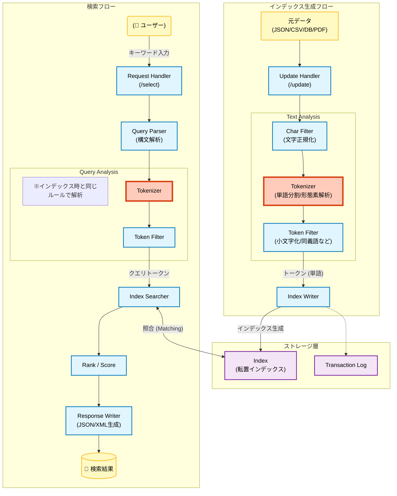

## 1. はじめに

この記事では株式会社 Inner Resource で検索エンジンを導入するにあたって行なった、社内勉強会の資料を公開します。

これから検索エンジンの導入を検討している方の参考になりましたら幸いです。

:::message
著者の経歴としては、検索エンジンの開発会社でのエンジニア経験や、業務および個人開発で Apache Solr の導入経験が 2 回ほどあります。検索エンジンのアーキテクチャの解説については Apache Solr よりの知識になっているためご了承ください。
:::

## 2. 検索エンジンの大まかな仕組み

検索エンジンは、大量のデータから高速に目的の情報を検索するためのシステムです。

元データをもとにテキスト解析を行い、事前にインデックス化することで、検索クエリに対して高速にマッチするドキュメントを返却することができます。

一般的な検索エンジンのインデックス生成から検索までのフローを以下に示します。

## 3. テキスト解析のアーキテクチャ

検索エンジンで検索意図に沿った検索結果を返却するためには、インデックス生成のテキスト解析の工程が最も重要になります。

テキスト解析の工程で重要な手法をいくつか紹介します。

### 3.1. Char Filter

文字列を解析する前の前処理として、不要なゴミを取り除いたり、特定のルールで文字を置き換えます。

Char Filter の例:

- HTML Strip Char Filter
  - HTML タグを除去する。
- Mapping Char Filter
  - 特定の文字を別の文字に置換する。（絵文字の変換や、全角英数の半角化など）
- Pattern Replace Char Filter
  - 正規表現を使って文字列を置換する。（製品型番のハイフン除去など）

### 3.2. Tokenizer

文字列を「トークン（単語）」に分割します。
トークンへの分割はテキストに含まれる言語によって、いくつか方法が存在します。

#### 空白単位での分割（Standard Tokenizer）

英語など単語の間に空白がある言語の場合は、空白や記号で簡単に分割ができます。

- 入力: "I love search engines!"
- 出力: [I], [love], [search], [engines]

:::message
日本語など空白や記号で分割ができない言語には適していません。
:::

#### 形態素解析（Japanese Tokenizer）

形態素解析は、辞書を使い意味のある単語単位で区切る方法です。

- 入力: "東京都民"
- 出力: [東京], [都民]

代表的な形態素解析ライブラリとしては、Mecab や Kuromoji が有名です。
日本語の形態素解析用の辞書としては、ipadic や ipadic-NEologd などが使用できます。

:::message
形態素解析のデメリットとして、辞書に登録されていない単語は上手く分割することができません。また、専門用語などは辞書が対応していないケースも多く、メインの辞書として ipadic を利用し、ipadic に登録されていない単語は追加で辞書登録を行う必要があります。
:::

#### N-gram（NGram Tokenizer）

機械的に N 文字ずつずらしながら区切る方法です。（例：2 文字＝ Bi-gram）

- 入力: "東京都民"
- 出力: [東京], [京都], [都民]

N-gram の場合は機械的に分割するため、辞書が不要で、どんな単語にもヒットさせることが可能です。

:::message
N-gram のデメリットとして、「京都」で検索しても「東京都民」がヒットしてしまうなど、検索意図とは異なる検索結果が返却される（検索ノイズ）可能性が高まります。また、2 文字(Bi-gram)で分割した場合は 1 文字のキーワード（例:「森」など）はヒットしません。
:::

#### 形態素解析と N-gram の併用

一つのドキュメントに対して、形態素解析と N-gram の両方でインデックスを作成し、検索時にも両方のフィールドを参照します。

フィールドに対する重みづけとして、形態素解析のフィールドに一致した場合を高く評価し、N-gram のフィールドで一致した場合は低く評価をすることで、検索結果としての網羅性を担保しつつ、並び順で検索意図に近いドキュメントは上位に表示することで検索体験を向上されることができます。

:::message
形態素解析と N-gram を併用する場合のデメリットとして、インデックスサイズが大きくなったり、インデクシングの時間が伸びることが考えられます。
:::

### 3.3. Token Filter

分割されたトークンに対して、加工・削除・追加などを行います。

#### 正規化系

- Lower Case Filter: 大文字を小文字にする。
  - [Solr] → [solr] （"SOLR" でも "solr" でもヒットするようになる）
- ASCII Folding Filter: アクセント記号などを基本的なアルファベットに戻す。
  - [café] → [cafe]
- Japanese Katakana Stem Filter: カタカナ語の語尾の長音（ー）を処理する。
  - [サーバー] → [サーバ]

#### 除去系 (ノイズを消す)

- Stop Filter: 検索に不要な一般的な語（ストップワード）を削除する。
  - [This], [is], [a], [pen] → [pen] ("is" や "a" は削除)
  - 日本語の場合: 「て」「に」「を」「は」などを削除

#### 拡張系 (ヒット率を上げる)

- Synonym Graph Filter (同義語): 別の言い回しをインデックスに追加する。
  - [スマホ] → [スマホ], [スマートフォン]

## 4. 検索エンジンの主な機能

検索エンジンには単純な全文検索以外にも、一般的に以下のような機能が含まれています。

### 4.1. 全文検索（Full-text Search）

テキスト全体を対象に、キーワードを含むドキュメントを高速に検索できます。

### 4.2. ファセット（Faceted Search）

検索結果を複数のカテゴリで分類・絞り込める機能です。
例えば、商品検索では「ブランド」「価格帯」「色」などで絞り込みが行えます。

### 4.3. サジェスト（Autocomplete/Suggestions）

ユーザーが入力する際に、よくある検索キーワードや関連キーワードを提案します。
一般的には、検索用のインデックスとは別にサジェスト用のインデックス用意する場合が多いです。

### 4.4. もしかして機能（Did you mean?/SpellCheck）

スペルミスや誤字を検出し、正しいキーワードを提案します。

### 4.5. 辞書機能

同義語や関連語を登録し、より広い検索を実現します。
その他、新語への対応として、形態素解析用の辞書のメンテナンスが必要な場合もあります。

### 4.6. 検索結果のハイライト

検索にヒットした文章の強調表示を行います。

### 4.7. 管理用インターフェイス

検索エンジンには、クエリ検索のテストや、登録データの確認、インデックスの更新などが可能な管理用インターフェイスが付属している場合が多いです。

## 5. 検索エンジンと RDB の比較

RDB はトランザクション管理や主キーなどインデックスを元にした検索を得意としています。
RDB でも簡単な全文検索も可能であるものの、インデックスが効きづらかったり、複雑なテキスト解析や検索結果のスコアリングが必要な場合は対応が難しくなります。

検索エンジンはその名の通り検索に特化しているため、クエリ検索や範囲検索、緯度経度検索、類似文章検索など複雑な検索条件でも高速にレスポンスを返すことができます。

以下は、RDB と検索エンジンの比較表です。

| 特性                       | RDB                             | 検索エンジン             |
| -------------------------- | ------------------------------- | ------------------------ |
| **用途**                   | トランザクション管理、ACID 特性 | テキスト検索、ファセット |
| **検索速度**               | 小〜中規模データで高速          | 大規模データでも高速     |
| **検索方法**               | SQL                             | REST / JSON 等の API     |
| **インデックス戦略**       | B-tree など                     | 転置インデックス         |
| **複雑なテキスト解析**     | 限定的                          | 充実している             |
| **多言語対応**             | 限定的                          | 充実している             |
| **検索結果のスコアリング** | 難しい                          | 得意                     |
| **リアルタイム更新**       | 即座に反映                      | 若干の遅延あり           |
| **運用コスト**             | 低め                            | 中〜高（別途構築・維持） |

## 6. 全文検索を行うための手段と技術選定の基準

全文検索を行うための一般的な手段と、それぞれの技術選定の基準を紹介します。

### 6.1. RDB で LIKE 検索

SQL の LIKE 句で部分一致検索を行います。

#### メリット

- データベース内で完結
- 運用が簡単
- 他のテーブルとの JOIN が可能

#### デメリット

- 中規模データ(数十万件)で検索速度が低下
- インデックスが効かず、フルスキャンになる
- 複雑な検索条件には対応できない

#### 技術選定基準

- データ件数が少ない（10 万件以下）
- 検索速度の要求が低い
- 複雑な検索要件がない

### 6.2. RDB の全文検索

MySQL、PostgreSQL などが提供する全文検索インデックスを活用します。

#### メリット

- データベース内で完結
- LIKE 検索より高速
- 他のテーブルとの JOIN が可能

#### デメリット

- 多言語対応は限定的
- 検索リクエストが増えた場合に簡単にスケールできない
- 類語やファセットなど複雑な検索要件への対応が難しい

#### 技術選定基準

- データ件数が数百万件程度
- 検索の利用頻度がそこまで高くない
- 複雑な検索要件がない

### 6.3. 検索エンジンの導入

RDB とは別に検索エンジンを独立したシステムとして導入します。

#### メリット

- 大規模データでも高速検索
- 高度なテキスト解析機能
- ファセット、サジェスト、スコアリング等が利用可能
- スケーラビリティに優れている
- 複雑なクエリに対応

#### デメリット

- 導入・運用コストが高い
- 別途サーバーリソースが必要
- 学習コストがある
- インデックスとデータベースの同期管理が必要

#### 技術選定基準

- 大規模データ（1,000 万件以上）
- 複雑な検索要件が必須
- 検索の利用頻度が高い
- 追加コストを負担しても採算がとれる

## 7. 代表的な検索エンジン

代表的な OSS の検索エンジンをいくつか紹介します。

一般的に有名なのは Apache Solr および ElasticSearch になります。この 2 つはいずれも Apache Lucene をベースとしているため、基本的な技術や機能はどちらもそこまで変わりません。

途中で ElasticSearch が SSPL/ELv2 ライセンスに変わったタイミングで、AWS が ElasticSearch から派生して、OpenSearch を Apache 2.0 ライセンスでリリースしています。

その他、比較的新しい検索エンジンとしては、Meilisearch なども登場しています。Meilisearch は検索 SaaS の Algolia をインスパイアしており、シンプルな設定で優れた検索体験(UX)を売りにしているため、複雑な検索要件がない場合は選択肢に入ります。

| 比較項目         | Apache Solr                                                                                                                            | ElasticSearch / OpenSearch                                                                                                                                                              | Meilisearch                                                                                                                                        |
| ---------------- | -------------------------------------------------------------------------------------------------------------------------------------- | --------------------------------------------------------------------------------------------------------------------------------------------------------------------------------------- | -------------------------------------------------------------------------------------------------------------------------------------------------- |
| **開発元**       | Apache 財団                                                                                                                            | Elastic 社 / AWS 社                                                                                                                                                                     | Meilisearch 社(フランス)                                                                                                                           |
| **ベース技術**   | Apache Lucene                                                                                                                          | Apache Lucene                                                                                                                                                                           | 独自開発                                                                                                                                           |
| **初版リリース** | 2004 年                                                                                                                                | 2010 年 / 2021 年                                                                                                                                                                       | 2023 年                                                                                                                                            |
| **ライセンス**   | Apache 2.0                                                                                                                             | SSPL/ELv2 / Apache 2.0                                                                                                                                                                  | MIT                                                                                                                                                |
| **開発言語**     | Java                                                                                                                                   | Java                                                                                                                                                                                    | Rust                                                                                                                                               |
| **API**          | REST API XML/JSON/CSV 対応                                                                                                          | JSON API                                                                                                                                                                                | JSON API                                                                                                                                           |
| **主な用途**     | ・大規模ウェブサイトのサイト内検索 ・エンタープライズ検索(組織内のドキュメント、ファイル等の横断検索) ・統計関数によるデータ集計 | ・メトリクスデータのリアルタイム収集や分析 ・IoT、センサーデータ等の時系列データ処理 ・NoSQL としての広範なデータストア ・モダンなアプリケーション検索(E コマース、地図検索等) | ・シンプルな検索クエリやファセットのみで十分な中規模サイトの検索 ・タイプミス補正や関連性の自動調整など複雑な設定なしで優れた検索体験(UX)を実現 |

## 8. まとめ

今回は検索エンジンの大まかな仕組みや、技術選定の基準、代表的な検索エンジンなどについて紹介しました。

株式会社 Inner Resource では現在、エンジニアを募集しています。興味がありましたらぜひ気軽にカジュアル面談にてお待ちしています。

## 参考リソース

- [Apache Solr 公式ドキュメント](https://solr.apache.org/guide/solr/latest/index.html)
- [Elasticsearch 公式ドキュメント](https://www.elastic.co/guide/jp/elasticsearch/reference/5.4/index.html)
- [OpenSearch 公式ドキュメント](https://aws.amazon.com/jp/what-is/opensearch/)
- [Meilisearch 公式ドキュメント](https://www.meilisearch.com/)
